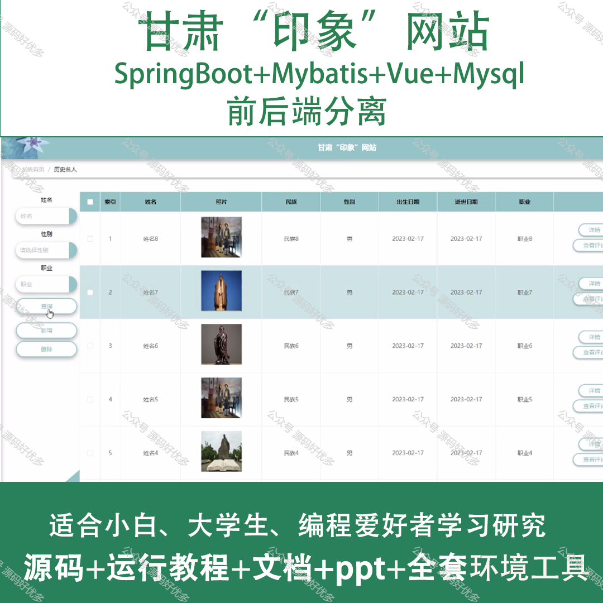
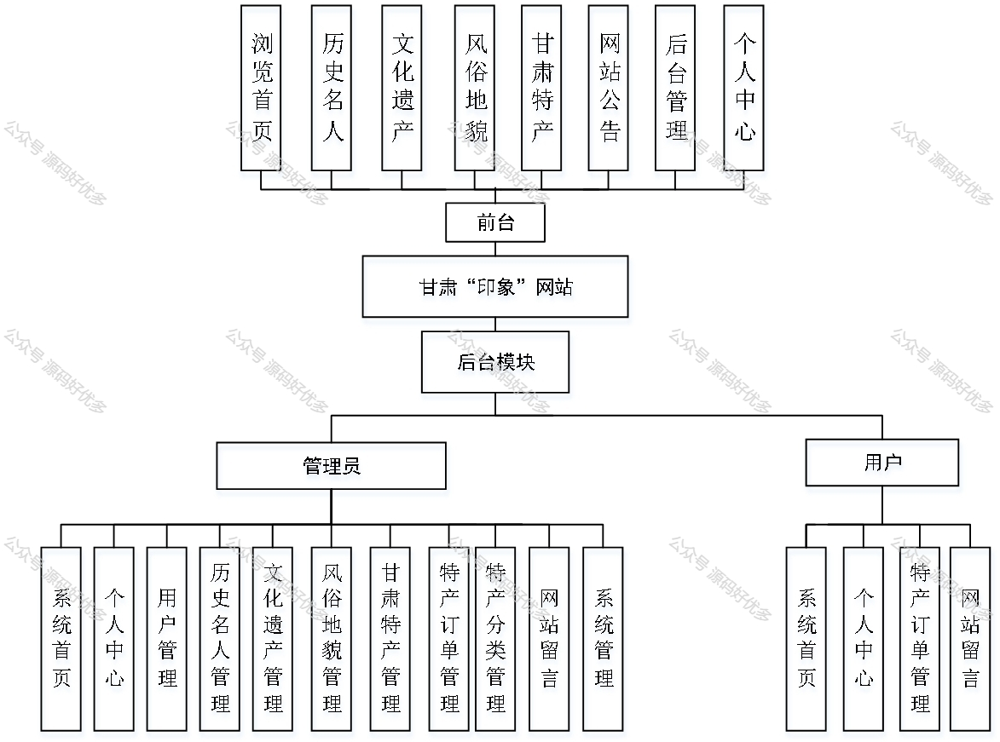
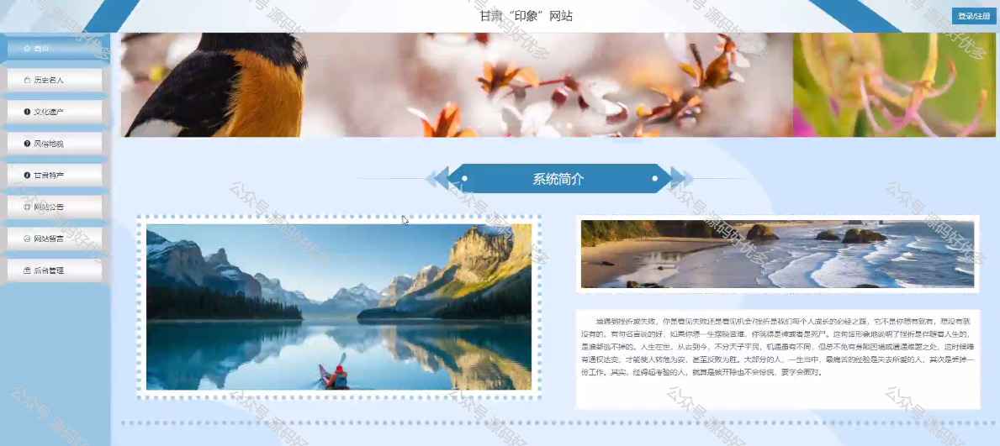
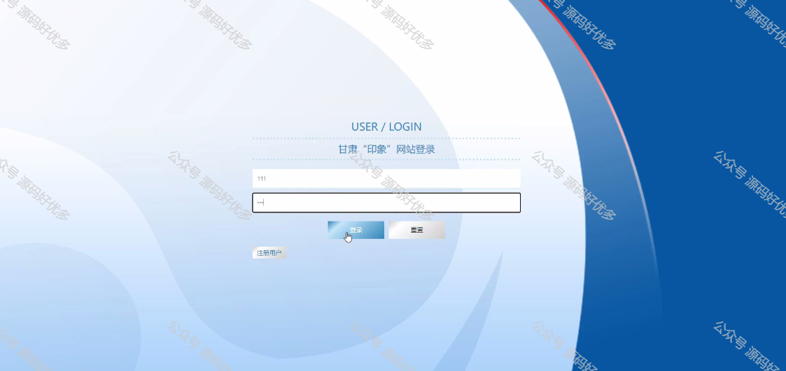
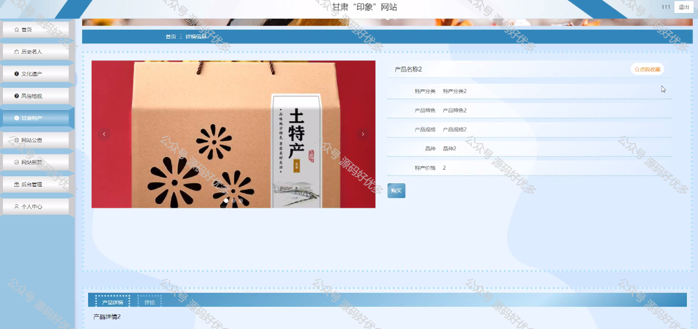
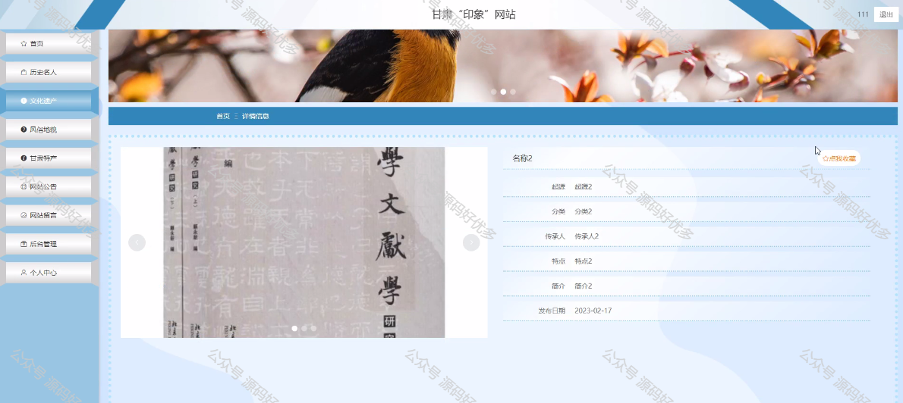
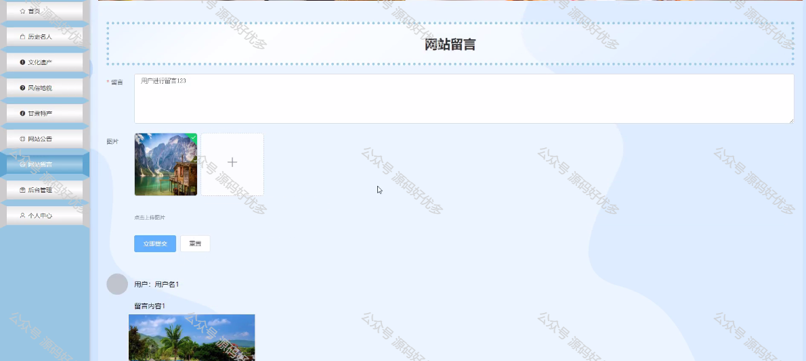
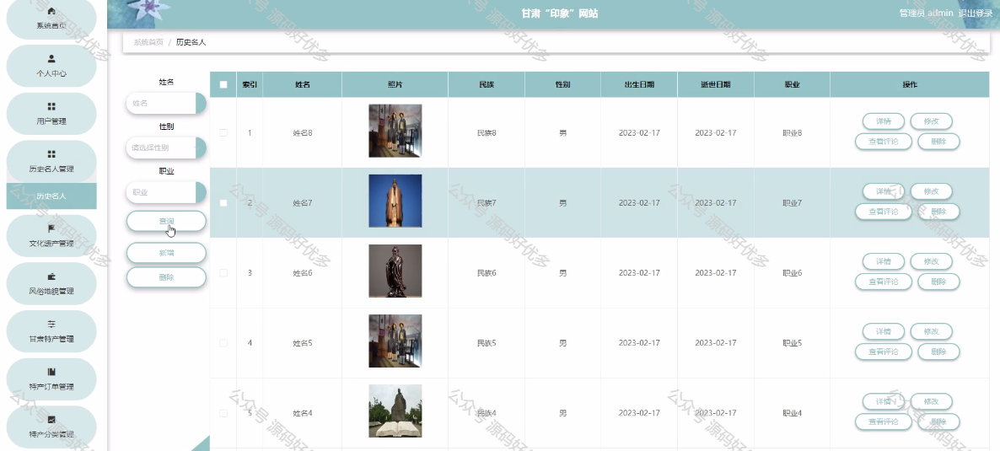
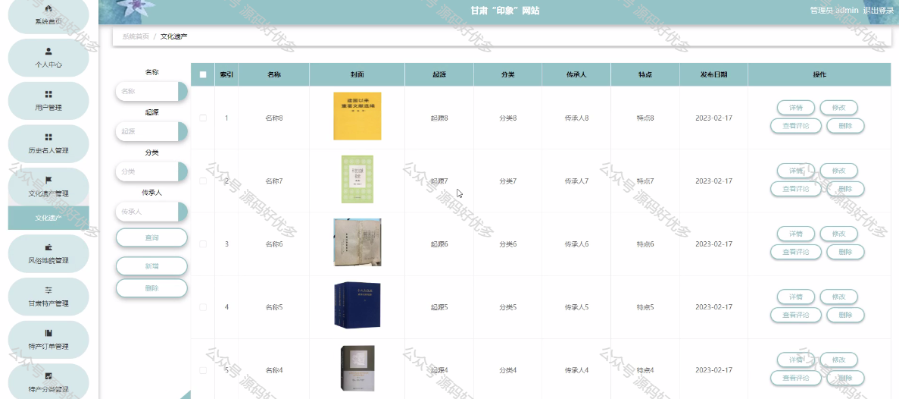
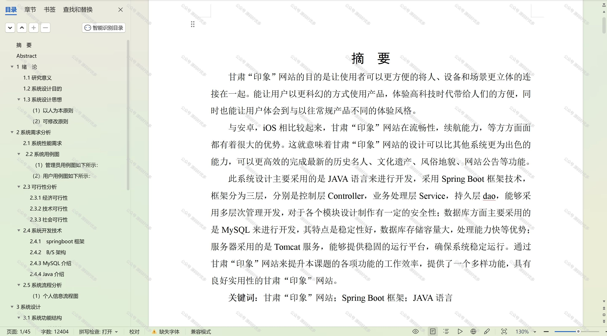

 
## 查看主页获取源码

### 一、作品包含

源码+数据库+设计文档万字+PPT+全套环境和工具资源+部署教程

### 二、项目技术

前端技术：Html、Css、Js、Vue、Element-ui

数据库：MySQL

后端技术：Java、Spring Boot、MyBatis

  

### 三、运行环境

开发工具：IDEA/eclipse

数据库：MySQL5.7

数据库管理工具：Navicat10以上版本

环境配置软件： JDK1.8+Maven3.6.3

前端Nodejs：14

### 四、项目介绍
项目编号：springbootA152

甘肃“印象”网站立足于展现甘肃省丰富的历史文化遗产和独特的自然风光，其背景是为了响应数字化传播的趋势，通过互联网平台推广甘肃的旅游资源，增强外界对甘肃的了解和认知，促进地区文化旅游产业的发展，同时为游客提供全面、便捷的在线旅游服务和资讯，打造甘肃对外宣传的新窗口。

前台用户功能：浏览首页、历史名人、文化遗产、风俗地貌、甘肃特产、网站公告、后台管理、个人中心。

后台分为管理员和用户
管理员的功能：系统首页、个人中心、用户管理、历史文化名人管理、文化遗产管理、风俗地貌管理、甘肃特产管理、特产订单管理、特产分类管理、网站留言、系统管理。
用户的功能：系统首页、个人中心、特产订单管理、网站留言。

### 五、运行截图

  
